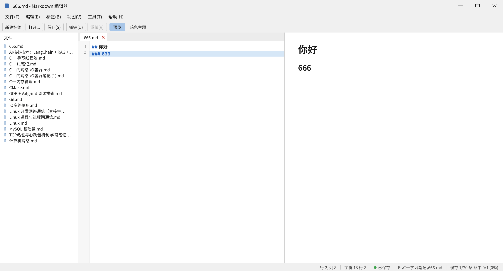
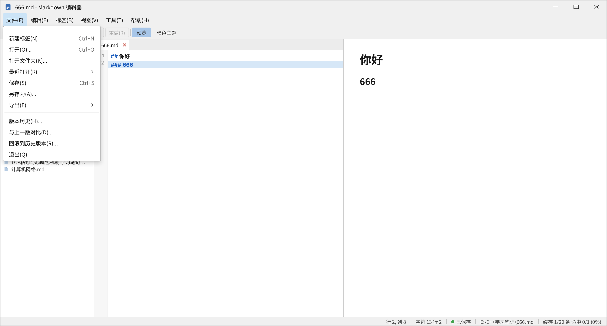
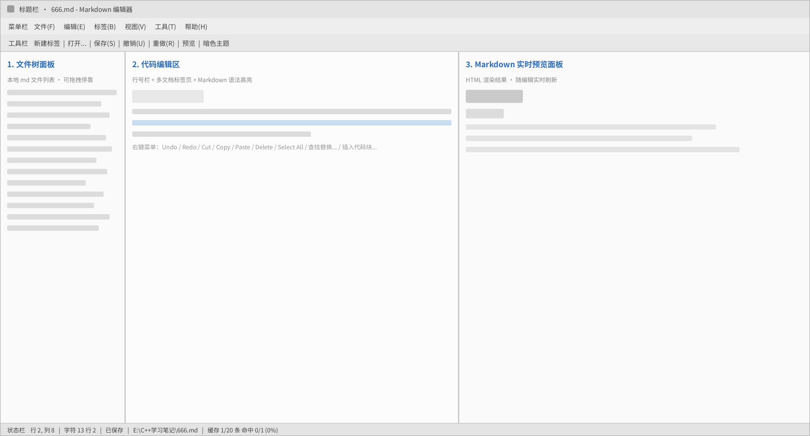

# muse-md Markdown 编辑器 · UI 设计规范

> 本文档基于软件**真实运行界面**整理，用于项目文档、团队沟通与作品展示。
> 设计原则：**不新增功能、不修改三栏布局、不删减任何菜单条目**；所有控件、菜单、快捷键均与现有 Qt6 实现保持一致。

- 画布基准：1360 × 733 px（浅色原生 Qt / Windows 风格）
- 一级菜单 6 个 · 菜单项 36 个 · 工具栏按钮 7 个 · 右键菜单项 9 个
- 配套设计稿：`docs/assets/` 目录下三张图

| 文件 | 内容 |
|---|---|
| `assets/ui-wireframe.png` | 低保真线框图（页面原型，含区域标注） |
| `assets/ui-hifi-main.png` | 高保真效果图（默认态） |
| `assets/ui-hifi-menu-file.png` | 高保真效果图（文件菜单展开态） |

---

## 一、界面结构与区域划分

窗口自上而下分为 5 个横向条带，中部为三栏可拖拽主体：

```
┌──────────────────────────────────────────────────────────────┐
│ ① 标题栏    666.md - Markdown 编辑器        － □ ×           │  高 30
├──────────────────────────────────────────────────────────────┤
│ ② 菜单栏    文件(F) 编辑(E) 标签(B) 视图(V) 工具(T) 帮助(H)   │  高 28
├──────────────────────────────────────────────────────────────┤
│ ③ 工具栏    新建标签 │ 打开... │ 保存(S) │ 撤销(U) │ 重做(R) │ 预览 │ 暗色主题 │  高 30
├──────────────┬──────────────────────────┬────────────────────┤
│              │ ④-b 标签页：666.md ✕     │                    │
│ ④-a          ├──────────────────────────┤  ④-c               │
│ 文件树面板   │  行号 │ Markdown 源码     │  实时预览面板      │
│  210 px      │       │                  │  590 px            │
│              │       │                  │                    │
├──────────────┴──────────────────────────┴────────────────────┤
│ ⑤ 状态栏  行 2, 列 8 │ 字符 13 行 2 │ ● 已保存 │ 路径 │ 缓存   │  高 21
└──────────────────────────────────────────────────────────────┘
```

| 编号 | 区域 | 说明 |
|---|---|---|
| ① | 标题栏 | 应用图标 + "文件名 - Markdown 编辑器" + 最小化 / 最大化 / 关闭 |
| ② | 菜单栏 | 6 个一级菜单，悬停高亮（`#CCE4F7`） |
| ③ | 工具栏 | 7 个按钮；「预览」为可勾选按钮，激活时填充 `#A8C6E8` |
| ④-a | 文件树面板 | 本地 md 文件列表，宽 210 px，**可上下左右拖拽停靠** |
| ④-b | 代码编辑区 | 多文档标签页 + 行号栏 + 语法高亮代码区 |
| ④-c | 实时预览面板 | Markdown → HTML 实时渲染结果，宽 590 px |
| ⑤ | 状态栏 | 行/列、字符统计、保存状态、文件路径、缓存信息 |

三栏之间为**可拖拽分割线**（1 px，`#D0D0D0`），用户可自由调整宽度。

---

## 二、UI 组件清单（控件 · 功能 · 快捷键）

### 2.1 标题栏

| 控件 | 内容 / 功能 | 快捷键 |
|---|---|---|
| 应用图标 | Markdown 编辑器标识 | — |
| 窗口标题 | `文件名 - muse-md`（随当前标签变化，带 `*` 表示未保存） | — |
| 最小化 / 最大化 / 关闭 | 标准窗口控制 | — |

### 2.2 菜单栏（6 个一级菜单 / 36 个菜单项）

> v1.0 设计稿是 32 项。C3 起陆续加了 4 项（标签 +1 / 视图 +2 / 工具 +1），
> 逐项的增减理由写在各菜单小节下面 —— 这份文档里**数字是可以变的，加减的理由不行**。

**文件(F)** — 11 项

| 菜单项 | 快捷键 |
|---|---|
| 新建标签(N) | `Ctrl+N` |
| 打开(O)... | `Ctrl+O` |
| 打开文件夹(K)... | — |
| 最近打开(R) | 子菜单 |
| 保存(S) | `Ctrl+S` |
| 另存为(A)... | — |
| 导出(E) | 子菜单 |
| 版本历史(H)... | — |
| 与上一版对比(D)... | — |
| 回滚到历史版本(R)... | — |
| 退出(Q) | — |

**编辑(E)** — 8 项

| 菜单项 | 快捷键 |
|---|---|
| 撤销(U) | `Ctrl+Z` |
| 重做(R) | `Ctrl+Y` |
| 剪切(T) | `Ctrl+X` |
| 复制(C) | `Ctrl+C` |
| 粘贴(P) | `Ctrl+V` |
| 全选(A) | `Ctrl+A` |
| 查找(F)... | `Ctrl+F` |
| 替换(H)... | `Ctrl+H` |

**标签(B)** — 4 项

| 菜单项 | 快捷键 |
|---|---|
| 关闭当前标签(W) | `Ctrl+F4` |
| 重新打开关闭的标签(R) | `Ctrl+Shift+T` |
| 下一个标签(N) | `Ctrl+Tab` |
| 上一个标签(P) | `Ctrl+Shift+Tab` |

> 「重新打开关闭的标签」没有可重开的记录时置灰（它挂在 TabManager 的"最近关闭"栈上）。
> `Ctrl+Shift+T` 原本是工具栏「暗色主题」的键，C3 起主题让位给 `Ctrl+Shift+D` ——
> 同一个 `QKeySequence` 装在两个动作上，Qt 只会发 `activatedAmbiguously`，**两边都不稳定**。
> 「重开刚关掉的标签」是浏览器/编辑器通用的手势，主题切换没有这种约定，所以按
> **通用约定优先于历史选择**取舍。

**视图(V)** — 8 项

| 菜单项 | 快捷键 |
|---|---|
| 左右分屏(1) | `Ctrl+1` |
| 仅编辑(2) | `Ctrl+2` |
| 仅预览(3) | `Ctrl+3` |
| 文件树(F) | 可勾选 |
| 全文搜索面板(S) | `Ctrl+Shift+F` |
| 大纲面板(O) | 可勾选（C4 新增） |
| 焦点模式(Z) | 可勾选（C5 新增） |
| 主题(T) | 子菜单 |

> **主题子菜单（C7）**：亮色 / 暗色（互斥）→ 分隔线 → 已导入的自定义主题（动态列出）→
> 导入主题… / 导出当前主题…。
> 选一个自定义主题 = **只换编辑器配色**（语法高亮 + 行号栏），控件外观（菜单/工具栏）仍跟随
> 亮/暗二选一。这是刻意的取舍：给每个自定义主题都配一套完整 QSS 会让"导入主题"变成
> "导入一整个皮肤包"，而用户最想要、也最容易分享的是**编辑器那套颜色**。
> 导入时做 WCAG 对比度校验（正文/语法色对底色 ≥ 4.5），不达标的直接拒绝并说清哪个颜色不合格。

> 「焦点模式」打开后只突出**光标所在的那一段**，其余行以半透明灰（`rgba(128,128,128,0.35)`）
> 淡化显示。淡化是"画在语法高亮之上的一层前景色"（`QTextEdit::ExtraSelection` 设
> `setForeground`，**不动背景**）—— 背景要留给当前行高亮与代码块底色，两层都用背景会互相涂掉。
> 淡化范围只算**视口内可见的行**，所以 3 万行的文档和 30 行的文档，打开的代价一样。

> **此处与 v1.0 设计稿的差异（C4 / C5 / C7）**：一级菜单仍是 6 个，但菜单项总数从 32 变成 **36**
> （一级项统计不含"主题"子菜单里动态列出的自定义主题项）：
> 标签 +1（C3「重新打开关闭的标签」）、视图 +2（C4「大纲面板」、C5「焦点模式」）、
> 工具 +1（C5「写作统计」）。
> 左边停靠区多了一个"大纲"页签 —— 它和"文件"**叠在同一个停靠区**，三栏布局没有变化，
> 所以设计稿里的三栏结构（侧栏 210px / 编辑器 / 预览）依然成立。

**工具(T)** — 3 项

| 菜单项 | 快捷键 |
|---|---|
| 清空内存缓存(C) | — |
| 插入代码块(K)... | — |
| 写作统计(S)... | —（C5 新增） |

> 「写作统计」是**点一下才算**的对话框，不在状态栏做实时字数 —— 每敲一个字就重算全文，
> 正是 A1 花力气搬走的那类主线程开销。统计口径（词怎么算、读几分钟）写在
> `src/core/document/textstats.h` 的头文件注释里，与实现的唯一来源。

**帮助(H)** — 2 项

| 菜单项 | 快捷键 |
|---|---|
| 关于(A)... | — |
| 关于 Qt(Q)... | — |

### 2.3 工具栏（7 个按钮）

| 顺序 | 按钮 | 功能 | 状态 |
|---|---|---|---|
| 1 | 新建标签 | 新建一个 md 文档标签页 | 普通 |
| 2 | 打开... | 打开本地 md 文件 | 普通 |
| 3 | 保存(S) | 保存当前文档 | 普通 |
| 4 | 撤销(U) | 撤销上一步编辑 | 普通 |
| 5 | 重做(R) | 重做被撤销的编辑 | 无历史时置灰 |
| 6 | 预览 | 显示 / 隐藏右侧预览面板 | **可勾选**，激活态 `#A8C6E8` |
| 7 | 暗色主题 | 切换浅色 / 暗色主题（`Ctrl+Shift+D`） | 普通 |

按钮之间以竖线分隔符（1 × 16 px，`#C8C8C8`）分组。

### 2.4 停靠面板（④-a：文件 / 大纲两页）

左侧停靠区里是**两页叠加**（`tabifyDockWidget`），底部用页签切换，默认停在「文件」。

| 控件 | 说明 |
|---|---|
| 页签「文件」 | 面板标题 12 px，`#1A1A1A`；文件条目 = 文档图标 + 文件名，11 px，超长文件名以省略号截断 |
| 页签「大纲」（C4 新增） | 当前文档的标题树，宽 210 px（与文件页同宽）。两列：标题（自动拉伸）+ 行号（右对齐、次要文字色）。`##` 是 `#` 的子节点，可折叠。空文档显示灰字「本文档还没有标题」；超过 30 万字符显示「文档过大，已暂停大纲」。点击一项 → 编辑器跳到那一行并拿到焦点 |
| 拖拽停靠 | 面板可拖拽到窗口的上 / 下 / 左 / 右停靠（两页一起走） |

> **此处与 v1.0 设计稿的差异（C4）**：左侧多了「大纲」页签。把它和「文件」叠在同一停靠区
> 是刻意的 —— 新开一列会破坏三栏布局（侧栏 210 px / 编辑器 / 预览 590 px），
> 而右侧要给预览、底部要给全文搜索（搜索结果是横向三列，需要宽度）。

### 2.5 代码编辑区（④-b）

| 控件 | 说明 |
|---|---|
| 标签页 | 多文档 Tab，含文件名与关闭按钮（红 `#C0392B`） |
| 行号栏 | 30 px 宽，`#F7F7F7` 底，与代码区同步滚动 |
| 代码区 | Markdown 语法高亮；标题标记 `##` / `###` 为 `#1F5FBF` 加粗 |
| 当前行高亮 | 整行 16 px，底色 `#D6E7F7` |
| 右键菜单 | 9 项，见下表 |

**编辑区右键菜单（9 项）**

| 菜单项 | 快捷键 |
|---|---|
| Undo | `Ctrl+Z` |
| Redo | `Ctrl+Y` |
| Cut | `Ctrl+X` |
| Copy | `Ctrl+C` |
| Paste | — |
| Delete | — |
| Select All | — |
| 查找/替换... | — |
| 插入代码块... | — |

### 2.6 实时预览面板（④-c）

| 控件 | 说明 |
|---|---|
| 渲染结果 | 左侧编辑内容实时转换为 HTML 并渲染 |
| 标题层级 | H2 26 px Bold / H3 20 px Bold |
| 内边距 | 左 36 px · 上 26 px · 右 24 px |

### 2.7 状态栏（⑤，5 段信息）

| 顺序 | 内容 | 示例 |
|---|---|---|
| 1 | 光标行列 | `行 2, 列 8` |
| 2 | 字符 / 行数统计 | `字符 13 行 2` |
| 3 | 保存状态 | `● 已保存`（绿色圆点 `#3FA34D`） |
| 4 | 当前文件完整路径 | `E:\C++学习笔记\666.md` |
| 5 | 缓存信息 | `缓存 1/20 条 命中 0/1 (0%)` |

段与段之间以竖线分隔符（1 × 12 px）分隔，整体右对齐。

---

## 三、配色规范（浅色原生 Qt 风格）

| 色值 | 用途 |
|---|---|
| `#F0F0F0` | 窗口底色 / 标题栏 / 菜单栏 / 工具栏 / 状态栏 |
| `#FFFFFF` | 编辑区 / 预览区 / 文件树面板底色 |
| `#D0D0D0` | 三栏可拖拽分割线 |
| `#C8C8C8` | 工具栏按钮组之间的竖线分隔符 |
| `#1A1A1A` | 主文本 / 窗口标题 / 菜单文字 / 预览标题 |
| `#6B6B6B` | 次要文本 / 菜单快捷键提示 |
| `#9A9A9A` | 行号 |
| `#4A4A4A` | 状态栏信息文字 |
| `#1F5FBF` | Markdown 标题标记符（## / ###） |
| `#2E6FBF` | 品牌强调蓝（文档标识 / 强调标注） |
| `#D6E7F7` | 编辑器当前行高亮 |
| `#CCE4F7` | 菜单、文件树条目的悬停 / 高亮态 |
| `#A8C6E8` | 工具栏「预览」激活（勾选）按钮底色 |
| `#3FA34D` | 「已保存」状态指示圆点 |
| `#C0392B` | 标签页关闭按钮 |
| `#B4B4B4` | 下拉菜单边框（含 `0,4,10` 投影） |

**设计说明**：整体沿用 Qt 原生浅色控件色系，以中性灰（`#F0F0F0`）作为界面骨架色，
用蓝色系（`#D6E7F7` → `#A8C6E8` → `#1F5FBF`）由浅到深表达「悬停 → 激活 → 强调」三级交互状态，
保证在长时间阅读与写作场景下低干扰、高可读。

---

## 四、字体与字号规范

| 应用位置 | 字号 | 字重 | 颜色 |
|---|---|---|---|
| 窗口标题 | 12 px | Regular | `#1A1A1A` |
| 菜单栏 / 菜单项 | 12 px | Regular | `#1A1A1A` |
| 下拉菜单快捷键 | 12 px | Regular | `#6B6B6B` |
| 工具栏按钮 | 11 px | Regular | `#1A1A1A` |
| 文件树面板标题 | 12 px | Medium | `#1A1A1A` |
| 文件树条目 | 11 px | Regular | `#202020` |
| 行号 | 11 px | Regular | `#9A9A9A` |
| 编辑区代码 | 12 px | Bold | `#1F5FBF` + `#1A1A1A` |
| 状态栏 | 11 px | Regular | `#4A4A4A` |
| 预览 H2 | 26 px | Bold | `#1A1A1A` |
| 预览 H3 | 20 px | Bold | `#1A1A1A` |

**字族**

- 界面字体：`Microsoft YaHei UI`（Windows 原生默认，设计稿中以 `Noto Sans SC` 等价呈现）
- 代码字体：等宽中英混排字体（设计稿中以 `Sarasa Gothic SC` 等价呈现），保证中英文对齐一致

**对话框与间距**

- 菜单项行高 25 px，菜单内边距 4 px，圆角 4 px
- 工具栏按钮行高 22 px，圆角 3 px，内边距左右 8 px
- 文件树条目行高 16 px

---

## 五、高保真效果图

### 5.1 默认态



### 5.2 文件菜单展开态



### 5.3 低保真线框图



---

## 六、设计约束

1. **布局零改动**：窗口标题栏 / 菜单栏 / 工具栏 / 左侧文件树 / 中间编辑区 / 右侧预览 / 底部状态栏的
   顺序、位置、比例与现有实现完全一致。
2. **菜单零删减**：6 个一级菜单共 32 个菜单项、右键菜单 9 项，条目、顺序、快捷键均照实呈现。
3. **无新增功能**：设计稿中出现的全部控件均已在现有代码中实现，不引入任何新按钮或新面板。
4. **可扩展性**：暗色主题通过替换同一套语义色（窗口底色 / 内容底色 / 主文本 / 强调蓝）实现，
   无需改动结构。

---

*文档版本 v1.0 · 对应软件版本 v1.0.0*
